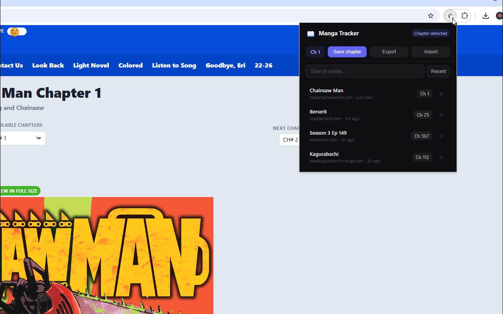

  

<h1 align="center">ScanMark — Manga Chapter Tracker</h1>

  A Chrome extension that automatically tracks your manga reading progress. 
  Never lose your place again.

  

---

## Features

- **Automatic tracking** — Detects chapter URLs as you read and saves your progress
- **Cross-device sync** — Your reading history syncs across all Chrome devices
- **Resume reading** — One click to jump back to where you left off
- **Search & sort** — Find any series by name, sort by recent, alphabetical, or chapter
- **Export / Import** — Back up your data as JSON or transfer it between browsers
- **Wide site support** — Works with Asura Scans, Flame Scans, Reaper Scans, MangaKakalot, Webtoons, TCB Scans, MangaBuddy, MangaReader, MangaFire, and many more
- **Privacy-first** — All data stays in your browser. Nothing is sent to external servers

## How it works

1. Install the extension
2. Read manga on any supported site
3. ScanMark automatically detects the chapter and saves the highest one you've read
4. Click the extension icon to see your full reading list
5. Click any series to resume reading from your last chapter

## Supported sites

| Site | Status |
|------|--------|
| Asura Scans | Supported |
| Flame Scans | Supported |
| Reaper Scans | Supported |
| MangaKakalot / MangaNato | Supported |
| Webtoons | Supported |
| TCB Scans | Supported |
| MangaBuddy / MangaPill | Supported |
| MangaReader / MangaFire | Supported |
| Any site with standard chapter URL patterns | Auto-detected |

## Installation

### From the Chrome Web Store
*Coming soon*

### Manual install (developer mode)
1. Download or clone this repo
2. Open `chrome://extensions/` in Chrome
3. Enable **Developer mode** (top right)
4. Click **Load unpacked** and select this folder
5. Start reading manga — ScanMark handles the rest

## Privacy

ScanMark does not collect, transmit, or share any personal data. All reading progress is stored locally in your browser using Chrome's built-in storage API. See the full [Privacy Policy](PRIVACY.md).

## License

MIT
